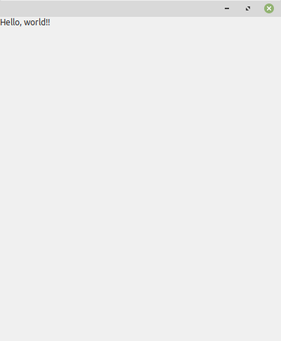
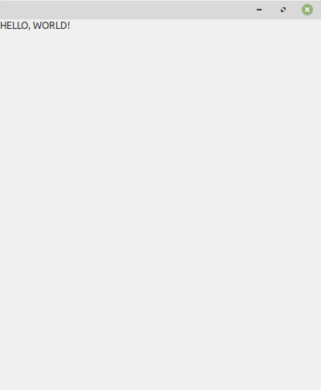

## 1. Hello, World!

### Getting Started

This shows how to start building a UI with wxml.

Run `<python> -m wxml hello.xml`

After running the above command, you should now see a window like the one below.

### Running in Design Mode

When you're starting to design a user interface, you probably don't want to
have to keep running the above command when you make changes to file. 

Fortunately, wxml can be told to watch the given filename for changes and
when it detects modifications, it will automatically rebuild the UI for you.

Run `<python> -m wxml --design hello.xml` or `<python> -m wxml -d hello.xml`

Now, open `hello.xml` in your text editor of choice and change the StaticText's text attribute
to something else (`"HELLO, WORLD!"`). After you save the file, the UI will rebuilt automatically and
you can see your changes.

